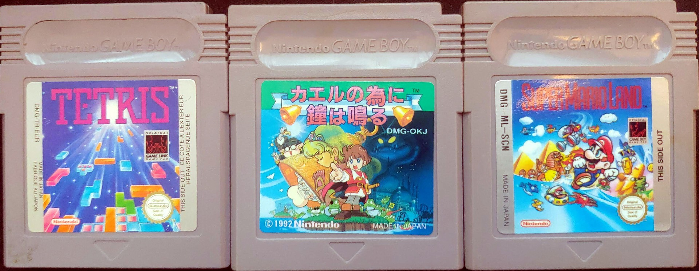

What does the code on a *Game Boy* cartridge mean? What language is the game in?

The codes on the game cartridges are usually divided into three groups.
But in some cases it can be two or four groups.

The *Tetris* above for instance has the code `DMG-TR-EU` and *Super Mario Land* has `DMG-ML-SCN`.
The middle cartridge *Kaeru no Tame ni Kane wa Naru (カエルの為に鐘は鳴る)* only has two groups, `DMG-OKJ`.

### First Group - Console
The first group is three letters that show which *Game Boy* the game was released for.

- **DMG** - Game Boy (Dot Matrix Game)
- **CGB** - Game Boy Color (Color Game Boy)
- **AGB** - Game Boy Advance (Advance Game Boy)

### Second Group - Game
The second group is 2-4 letters and/or digits. This part of the code is the identifier for the game itself.
As you can see in the photo above, the code for *Tetris* is `TR`, and *Super Mario Land* is `ML`.

### Third Group - Country/Area
The third group is three letters showing what area the game was released in.
As you can see there are multiple overlaps.
To make things a little more confusing, some cartridges released in Japan doesn’t even have a country/area code, as you can see in the photo above.

- **ASI** – Asia (Not Japan or China)
- **AUS** – Australia
- **CAN** – Canada
- **CHN** – China
- **ESP** – Spain
- **EUR** – Europe & Australia
- **FAH** – France & Netherlands
- **FRA** – France & Belgium
- **FRG** – Germany, Switzerland, Germany
- **GPS** – Used for countries/areas without a matching code.
- **HOL** – Netherlands & Belgium
- **ITA** – Italy
- **JAP** – Japan
- **NOE** – Germany
- **SCN** – Scandinavia (Sweden, Norway, Denmark, Finland)
- **UKV** – United Kingdom
- **USA** – USA & Mexico

### Fourth Group - Incrementation
Some cartridges have a fourth group, consisting of a single digit.
This is an incrementation number that is added when a new revision is released with changes in hardware, packaging or labels.

### Game Database
For a searchable database of all released cartridges, visit https://www.game-boy-database.com.