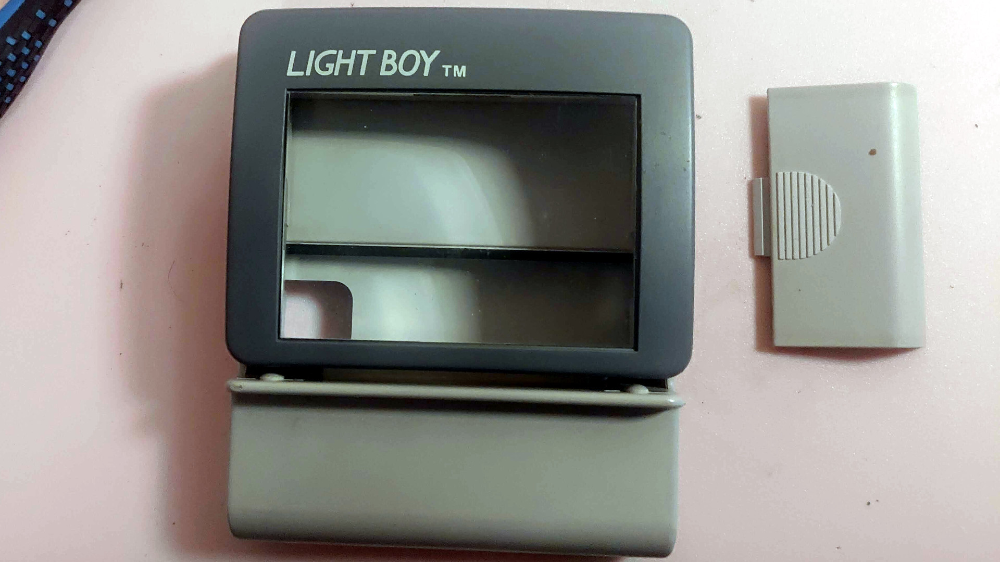
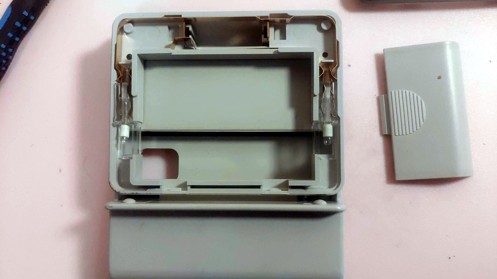
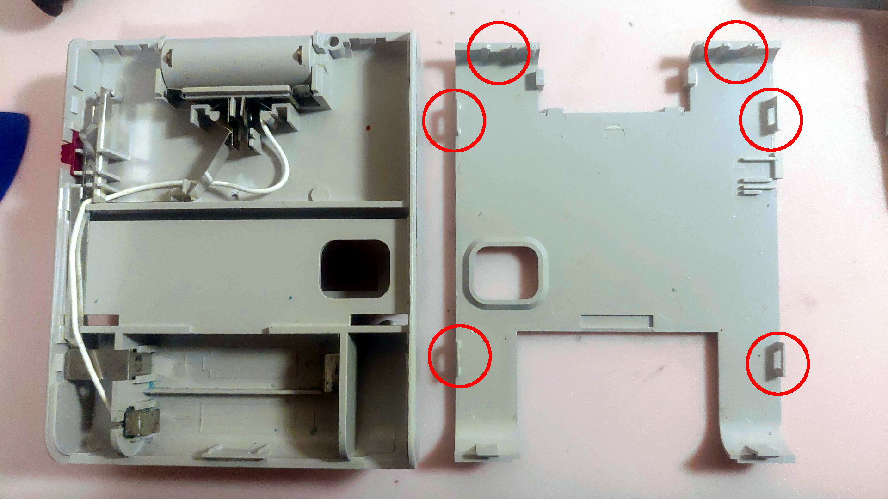
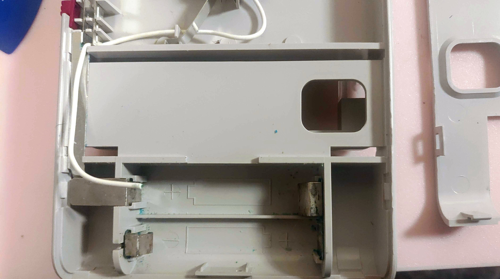
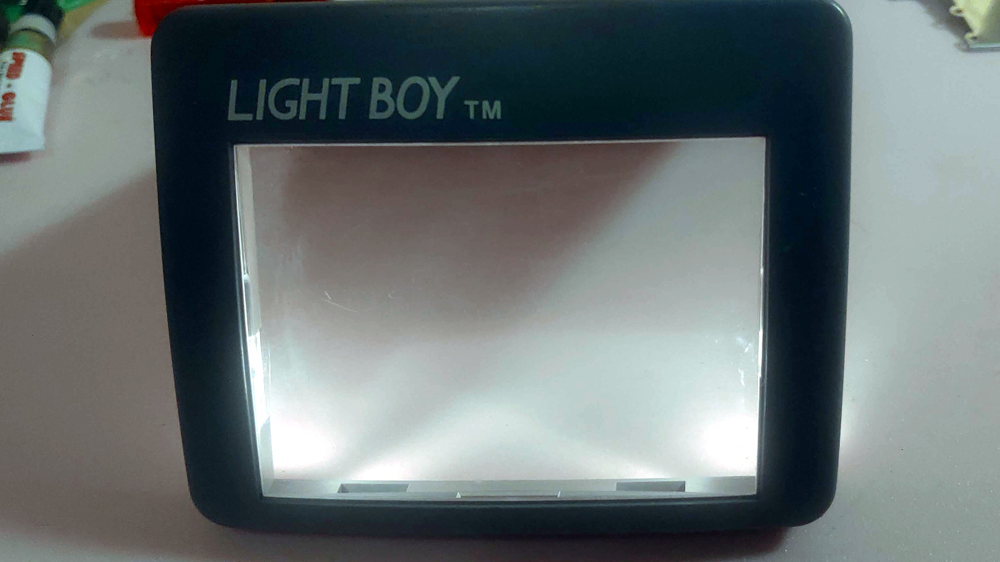
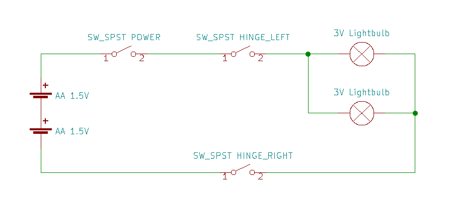

The *Light Boy* is an officially licensed accessory for the original *Game Boy* produced by *Vic Tokai Inc*.
It provides magnification and lighting for the screen. It is powered by 2 1.5V AA batteries.

There are two 3V light bulbs; one on either side of the magnification glass.
With the dark gray cover removed, the bulbs and the copper strips that supply the power is visible.

In the above picture, the outer copper strip is ground, and the smaller inner strip is connected through an on/off switch to the positive battery terminal.
The bulbs are only connected to the batteries when the lid with the magnification glass is folded out.
There are two metal points in the hinge that breaks contact when it is folded down.

The back of the case is held in place by six plastic clips, marked in red in the below photo.
Be careful, as plastic this old can be quite brittle.

This unit had some corrosion on the battery terminals and the white wire between the bulbs and battery negative was badly corroded and had to be completely replaced.
Some of the plastic pins that hold the metal strips in place was broken and had to be glued back in place.

The bulbs were fully functional and after the mentioned repairs the Light Boy was back in working order.

Below is a schematic to show how the bulbs are connected.

